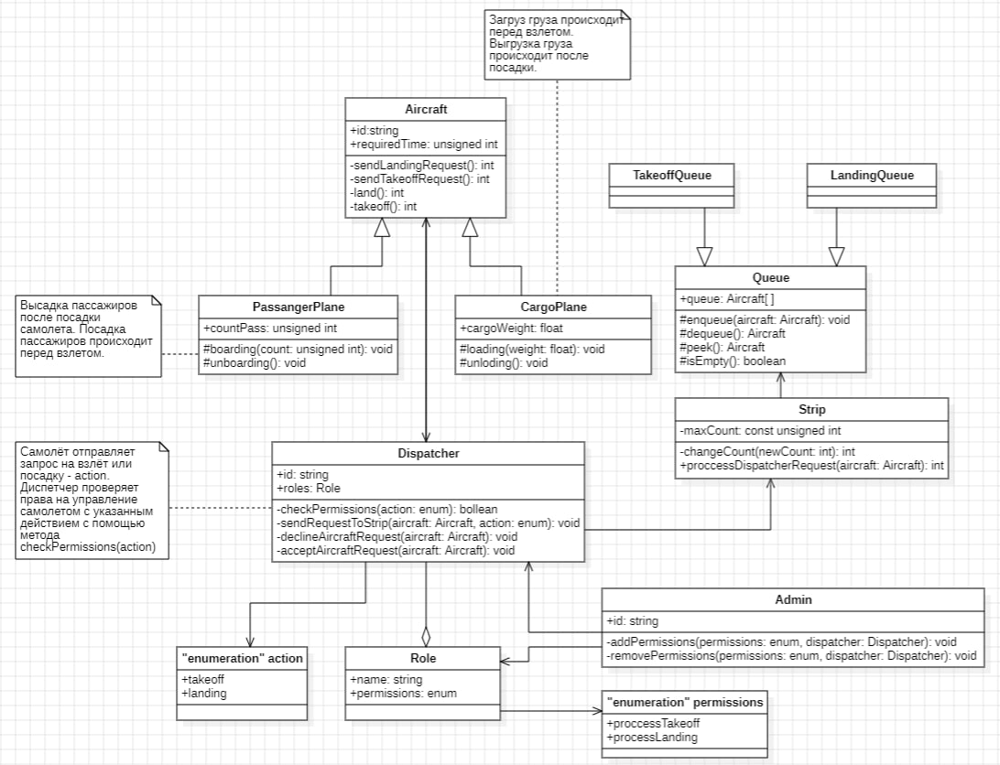

# NAPO-LR1-UML

Бригада №6 группы М3О-310б-21:
1. Великанова Анна
2. Захаров Егор
3. Пихотина Ксения

### Задание:
Составить 5 UML-диаграмм для программы контроля доступа и очереди взлётно-посадочной полосы (очередь, взлёт, посадка)

## Диаграмма классов

## Диаграмма компонентов

## Диаграмма последовательности

## Диагрмма UseCase

## Диаграмма состояний

